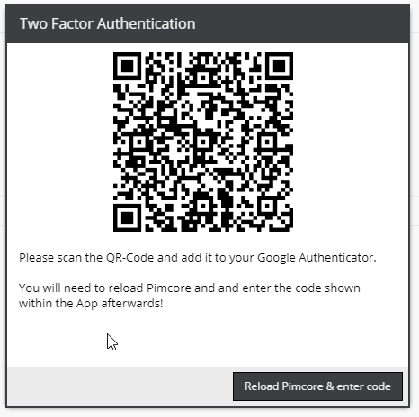
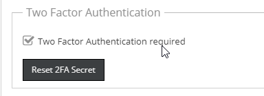
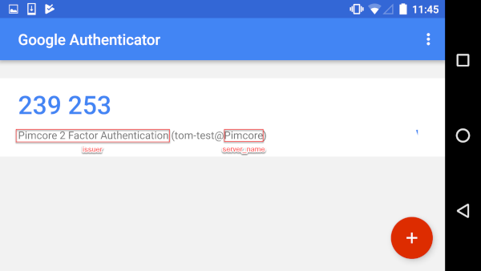

# Two Factor Authentication

Pimcore has an integrated two factor authentication using the Google Authenticator ([Android](https://play.google.com/store/apps/details?id=com.google.android.apps.authenticator2), [iOS](https://itunes.apple.com/at/app/google-authenticator/id388497605))

## User Setup

By default, each user enables or disables their two factor authentication in the profile settings.
 
**(Settings -> My Profile)**

After enabling it a secret will be generated and you can set up your Google Authenticator App.

**Please be aware if you don't setup the App properly you will lose access to your account!**


 

After reloading you will be prompted to enter the verification code for the first time.

 
 
## Admin Setup

To force users to use two factor authentication, check 'Two Factor Authentication required' in the Users menu.
 
**(Settings -> Users / Roles -> Users)**

 

If this is enabled the user will have to setup two factor authentication and cannot disable it anymore.
  
  
## Config
To change the default name / description displayed in the app, overwrite the following config:

```yaml
 scheb_two_factor:
     google:
         server_name: Pimcore                                # Server name used in QR code
         issuer: Pimcore 2 Factor Authentication             # Issuer name used in QR code
```

 
 