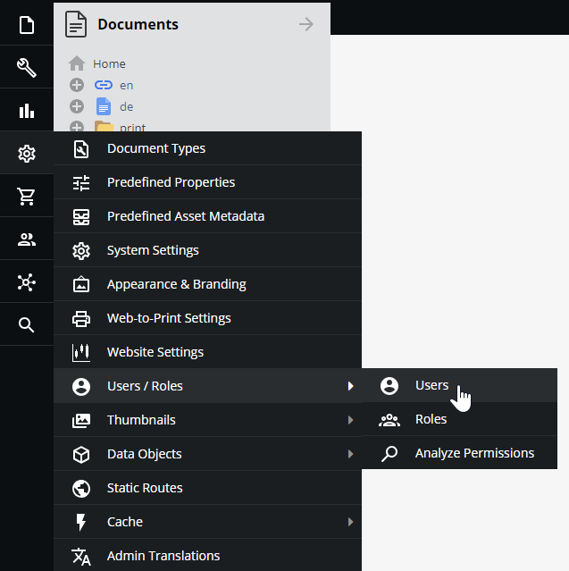
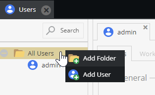
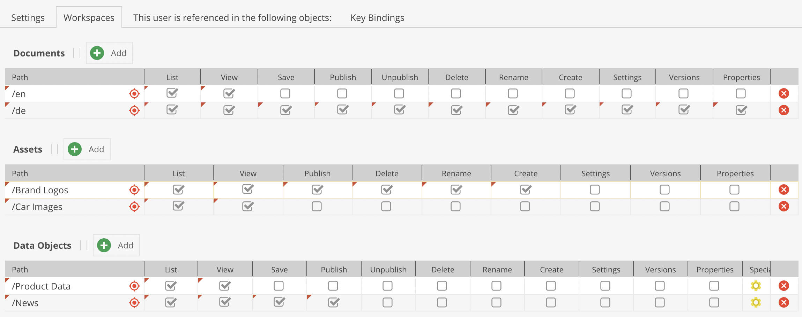
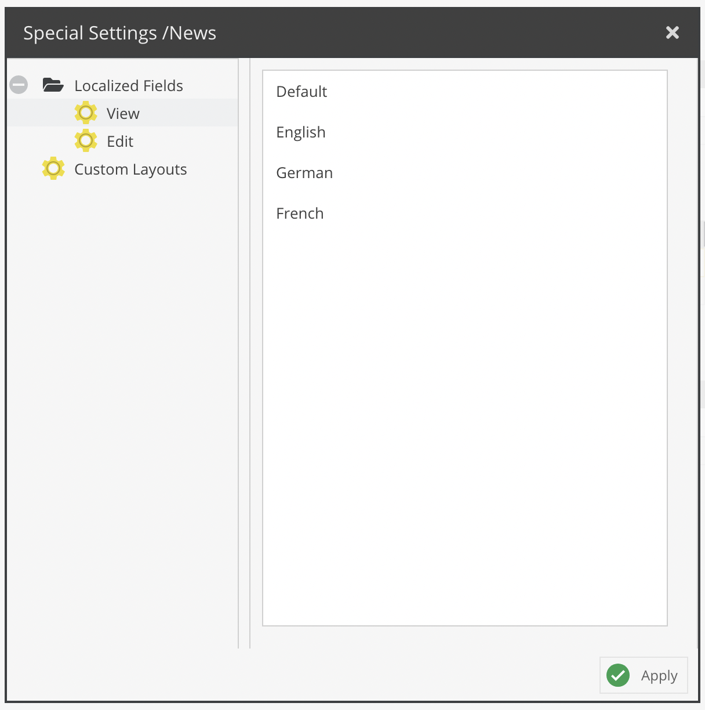

# Users and Roles

## General

User permissions in Pimcore are based on users and roles. Each user can have several roles, and both users and roles can have permissions. 
 
Users and roles are configured in Pimcore Studio at `Settings` > `Users & Roles` > `Users` and
 `Settings` > `Users & Roles` > `Roles`. 

## Add a New User/Role

To add a new user in the `Users` tab, right-click on the folder corresponding to the new user's category in the tree and select `Add User`. You can add a new role similarly in the `Roles` tab.

## Permissions
In Pimcore, there are two levels of user permissions: 
1) Permissions on system components,
2) Permissions on data elements (Assets, Data Objects, and Documents). 

Grant permissions to individual users or groups of users (called "roles" in Pimcore).
The sections below cover how and where to set permissions and how they interact.

Using roles is not mandatory - you can grant permissions to users directly. However, roles are recommended
for larger user groups. In the `Users/Roles` settings tab, select which permissions to grant to a user or role.
An individual user has a few more general settings than the role.

### System Permissions

* Admin - if checked, all permissions on all system components are granted to that user
* Show welcome screen on startup
* Show close warning
* Roles - Select all roles incorporated by the user
* Perspectives - Which [perspectives](../03_Perspectives/02_Perspectives.md) are available for this user

System permissions available for users and roles:

* **Assets**: Assets tree is visible
* **Classes**: Object classes editor visible (user can create and modify object classes)
* **Clear Cache**: defines if a user may clear Pimcore cache (internal cache and response cache if configured)
* **Clear Temporary Files**: defines if user may delete temporary system files (e.g thumbnails)
* **Dashboards**: User can create Dashboards
* **Documents**: Documents tree is visible
* **Document Types**: User can create and modify predefined document types
* **Emails**: User sees E-Mail history
* **Extensions**: specifies if a user is allowed to download install and manage extension
* **Glossary**: Glossary entries visible
* **HTTP Errors**: HTTP Errors are visible 
* **Notes & Events**: Notes & Events are visible 
* **Objects**: Objects tree is visible 
* **Predefined Properties**: User can create and modify predefined properties
* **Recycle Bin**: User has access to the recycle bin and see all the deleted elements (even by other users).
* **Redirects**: User can create and modify redirects
* **Reports**: User has access to reports module
* **Seemode**: Seemode available/not available for user
* **Select Options**: Object [select options editor](https://github.com/pimcore/pimcore/blob/2026.x/doc/03_Objects/01_Object_Classes/01_Data_Types/77_Select_Options.md)
* **SEO Document Editor**: User has access to SEO document editor
* **System Settings**: User has access to system settings
* **Tag & Snippet Management**: User can create and modify entries in tag & snippet management
* **Targeting**: User has access to targeting module
* **Thumbnails** User can create and modify thumbnail configurations
* **Translations**: defines whether a user may view and edit website translations
* **Users**: defines whether a user may manage other users' settings and system permissions
* **Website Settings**: User can create and modify website settings

Users benefit from any system permission granted to them directly or to any role they incorporate.
A permission granted through a role cannot be rescinded for that particular user. Once a role grants
a permission, unchecking the user's individual permissions checkbox has no effect.

### Element Permissions - Workspaces

Beyond the permissions mentioned above, restrict a user's access on an element basis by defining workspaces
for a user or role. Provided that a user may generally access documents, specify what a user/role may do
or not do with each document or workspace. The same applies to Data Objects and Assets.
Configure these settings in the `Workspaces` tab of a user/role.

Grant a user access to one or more workspaces. The user cannot access any resources outside their workspace(s).

However, there are a few general rules on element permissions that need to be regarded:
* if a user does not have the right to list an element, all other permissions are obsolete.
* if a user does not have the list permission on an element, all permissions on this element's children are obsolete.

Workspace permissions per element (applies to the element and its children):

* **list**: list in tree
* **view**: open in editor
* **save**: save (save button visible)
* **publish**: publish (publish button visible)
* **unpublish**: unpublish (unpublish button visible); not available for assets
* **create**: create child elements (not available for assets)
* **delete**: delete
* **rename**: rename
* **settings**: manage settings (settings tab visible); also controls the path and the right to move the element in the tree
* **versions**: access the `versions` tab
* **properties**: manage the `properties` tab

Individual users are granted access to all defined workspaces for any role they incorporate. In addition to that, users can have their own workspaces. These are added to the permissions granted by roles.

For example, a role `myRole` has been granted list and view access to `/home/myPath`. The user editor incorporates the role `myRole` and thereby inherits all workspace settings from the role. 
In case the editor has his own workspace settings on `/home/myPath`, these permissions are added to permissions from any role they incorporate.

:::caution

Be aware that if individual permissions granted to a user are different from the ones granted by its role for the same workspace, user permissions win over the ones attributed to the role. This implies that if the user has fewer permissions granted as an individual than through its role, the role's permissions will also be overruled.

For example, a user has only `List` permissions on a workspace, but its role defines `List`, `View`, `Save`, and `Publish` permissions for the same workspace. Because its individual permissions are restricted, this user will only have the possibility to see the workspace tree allowed by its `List` permissions.

:::

It is also possible to restrict access to localized fields on a language level. By default, users can view and edit (as long as they also have sufficient object permissions) all localized fields. This can now be restricted to a subset of languages. 

The configuration panel is accessible via the `Special Settings` column. The same dialog also allows to specify available custom layouts for the user. 

#### Dynamically Control Permissions on Elements

By using the event `Pimcore\Event\ElementEvents::ELEMENT_PERMISSION_IS_ALLOWED`, it is possible to dynamically manipulate a user's permissions on a specific element on request.

:::note
When listing (tree view, search, etc.), this event fires afterward on each element of the filtered result list.
Therefore, granting a `list` permission on a disallowed element (list=0) does NOT affect the listing conditions
or results (the element is not considered as allowed for filtering purposes).
:::
