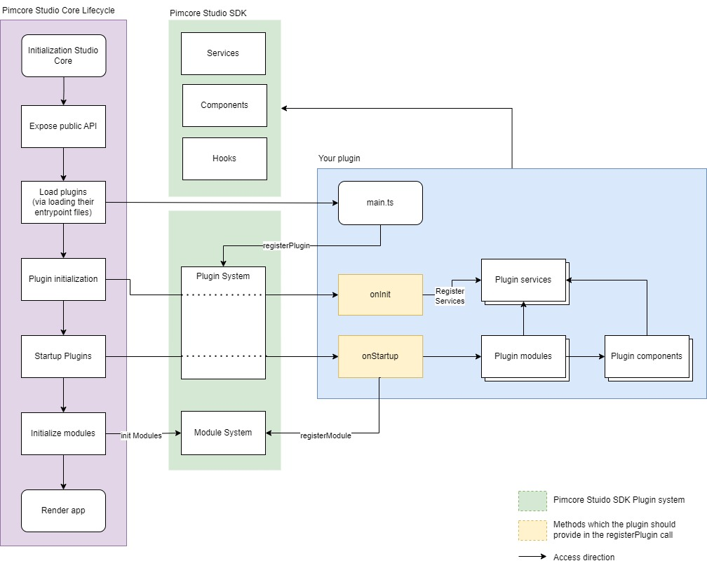

# Plugin Architecture, Plugins, and Modules

## Plugin Architecture

Overview of how a plugin would be integrated in the Pimcore Studio Core lifecycle:



---

## Plugins

Plugins empower you to enhance the Pimcore Studio UI by integrating methods directly into its lifecycle.

### Key Methods

#### `onInit`

The `onInit` method is triggered early in the lifecycle. It allows you to register new services or override existing ones.  
Example: Replacing the default tab manager for folder assets.

```typescript
onInit: ({ container }): void => {
    container.rebind(serviceIds['Asset/Editor/FolderTabManager']).to(ExtendedFolderTabManager).inSingletonScope()
},
```

#### `onStartup`

The `onStartup` method ensures that all your registered modules execute at the appropriate time.  
Example: Registering a custom module.

```typescript
onStartup: ({ moduleSystem }): void => {
  moduleSystem.registerModule(FolderTabExtension)
}
```

For more details on plugins, refer to the [Plugin system source](https://github.com/pimcore/studio-ui-bundle/blob/1.x/assets/js/src/core/app/plugin-system/plugin-system.ts).

---

## Modules

Modules consist of code snippets executed immediately after initializing all services from the Studio UI Core and Plugins.  
They run before the initial app render, enabling you to leverage existing services (such as a tab manager) to provide additional configuration for React components during rendering.

### Example: Registering a New Tab for Folder Assets

```typescript
export const ImageSliderModule: AbstractModule = {
  onInit: (): void => {
    const tabManager = container.get<FolderTabManager>(serviceIds['Asset/Editor/FolderTabManager'])

    tabManager.register({
      children: <ImageGallery />,
      icon: <Icon name={'camera'} />,
      key: 'image-gallery',
      label: 'Image Gallery'
    })
  }
}
```

For more details, refer to the [Module system source](https://github.com/pimcore/studio-ui-bundle/blob/1.x/assets/js/src/core/app/module-system/module-system.ts).