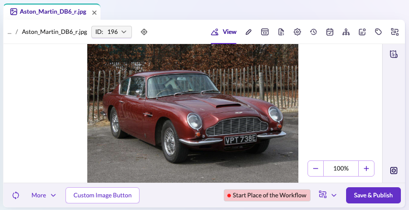

# How to Add an Additional Button to the Asset Editor Toolbar

## Overview
Add a new button to the toolbar of the asset editor in Pimcore Studio for image assets.

## Screenshot

## Details
Add buttons to the asset editor toolbar using the `ComponentRegistry` service and its slots. Slots allow developers to inject custom components into specific areas of the UI. In this example, the button is added to the toolbar left slot of the asset editor.

The example uses the asset context and draft to ensure the button is only displayed for image assets. This is achieved by taking the asset draft (out of redux) and checking if its type equals `image`.

## Code Example on GitHub
> [Additional asset editor toolbar button example on GitHub](https://github.com/pimcore/studio-example-bundle/tree/main/assets/js/src/examples/asset-editor-toolbar-button).

