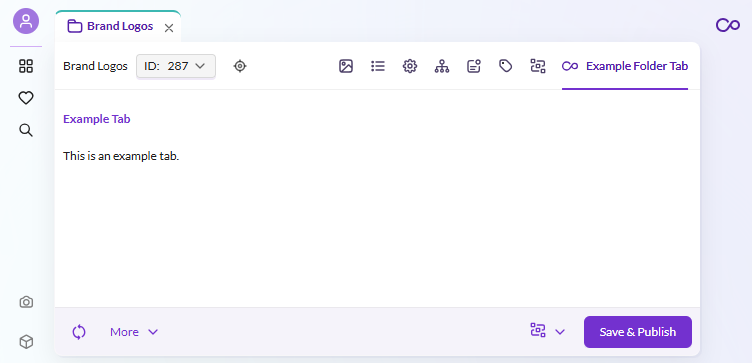
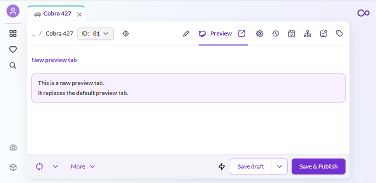

# How to Use the Tab Manager

## Overview

Use the different tab managers of Pimcore Studio to add new tabs or overwrite existing ones in the different element types.

## Screenshot

## Details

Tab managers in Pimcore Studio control which tabs are displayed in the element editors (assets, data objects, documents). Each element type has its own tab manager service that you can retrieve from the DI container.

Key steps:
- Retrieve the appropriate tab manager service from the container (e.g., `serviceIds['Asset/Editor/FolderTabManager']`)
- Use the `register` method to add a new tab with a component, icon, key, and label
- Optionally, override the entire tab manager by rebinding the service in the `onInit` plugin lifecycle method

For more details on the DI container and service IDs, see the [Services and Dependency Injection](../../01_Architecture_Overview/01_SDK_Overview/03_Services_and_Dependency_Injection.md) documentation.

## Code Example on GitHub
> [Tab manager example on GitHub](https://github.com/pimcore/studio-example-bundle/tree/main/assets/js/src/examples/custom-tab-manager).
