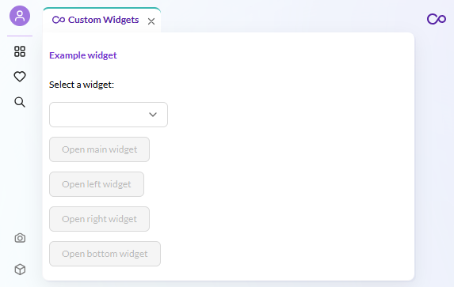

# How to Use the Widget Manager

## Overview

This example registers a custom widget component and opens it programmatically
in different panel areas of Pimcore Studio.

Pimcore Studio has two widget systems that work together:

1. **Widget Manager** (`WidgetRegistry` + `useWidgetManager`) - registers React components
   by name and opens them as panels in main/left/right/bottom areas. This is the rendering system.

2. **Widget Editor** (`DynamicTypeWidgetTypeAbstract` + `DynamicTypeWidgetTypeRegistry`) -
   registers widget type definitions for the perspective editor. This is how the perspective editor
   discovers widget types, shows them in the "add widget" dropdown, and renders configuration forms.

The Widget Editor tells the perspective editor what widget types exist and how to configure them,
while the Widget Manager renders the actual widget component at runtime.

## Screenshot

## Details

### Widget Manager

Register a widget component in a module via the `WidgetRegistry`, then open it with the
`useWidgetManager` hook. The hook provides methods for each panel area:
`openMainWidget()`, `openLeftWidget()`, `openRightWidget()`, `openBottomWidget()`.

### Widget Editor Integration

To make a custom widget type available in the perspective editor,
register a `DynamicTypeWidgetTypeAbstract` subclass:

- `id` - must match the backend widget type string registered
  in `pimcore_studio_backend.widget_types`
- `name` - display name in the dropdown
- `group` - groups related widget types
- `icon` - icon name from the Pimcore icon library
- `form()` - returns the configuration form for the perspective editor

Bind the class in your plugin's `onInit`, then register it in the
`DynamicTypeWidgetTypeRegistry` via a module.

### Key Mapping

The widget type string must match between:
- Backend `pimcore_studio_backend.widget_types` config
- Backend `WidgetConfigRepositoryInterface.getSupportedWidgetType()`
- Backend `WidgetConfigHydratorInterface.getSupportedWidgetType()`
- Frontend `DynamicTypeWidgetTypeAbstract.id`

## Code Example on GitHub

> [Custom widgets example on GitHub](https://github.com/pimcore/studio-example-bundle/blob/main/assets/js/src/examples/custom-widgets/index.ts).

## Related

- [Extending Widgets (Backend)](https://github.com/pimcore/studio-backend-bundle/blob/1.x/doc/03_Extending/11_Perspectives/01_Extending_Widgets.md) -
  widget type registration, repository, hydrator, schema
- [Custom Perspective Widgets](https://github.com/pimcore/pimcore/blob/2026.x/doc/10_Extending_Pimcore/03_Custom_Extension_Guides/14_Custom_Perspective_Widgets.md) -
  cross-layer guide
