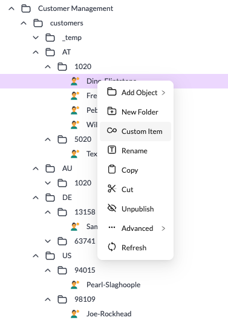
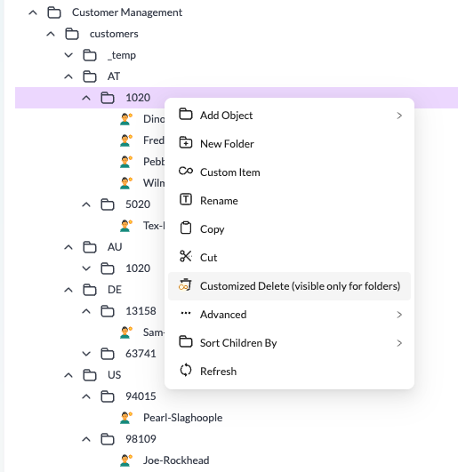

# How to Customize Context Menus

## Overview
Add custom items to context menus and modify existing menu items in Pimcore Studio. Context menus appear on right-click in tree views, grids, and other areas.

## Example 1: Add a Custom Context Menu Item

### Details
This example adds a new "Custom Item" entry to the data object tree context menu that displays an alert when clicked.

## Example 2: Modify an Existing Context Menu Item

### Details
This example modifies the delete context menu item to only be visible for folders, with a custom label and icon.

## Code Example on GitHub
> [Context menu customization example on GitHub](https://github.com/pimcore/studio-example-bundle/tree/main/assets/js/src/examples/data-object-context-menu).
