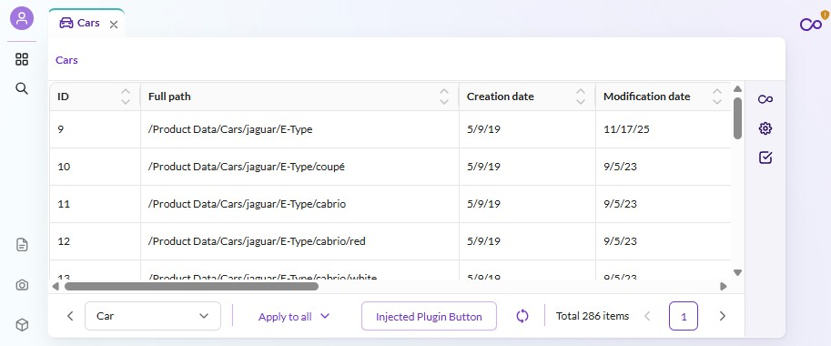

# How to Create a Custom Listing

## Overview
Create a Custom Listing based on an existing Data Object Listing.

## Screenshot

## Details
This example reuses the existing Listing defined for data objects and adds additional functionalities like:

  - A new Menu Entry to open the new listing
  - Limitation to one Class Definition
  - Adding of a new buttons to the listing toolbar
  - Disabling of existing listing features like filters
  - Adding new sidebars that interact directly with the listing
  - Adding a header for a custom listing

## Code Example on GitHub
> [Create a Custom Listing example on GitHub](https://github.com/pimcore/studio-example-bundle/tree/main/assets/js/src/examples/listings).

