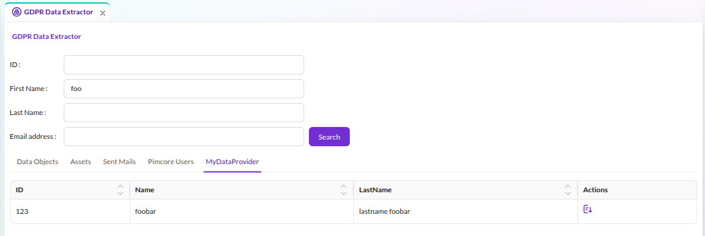

# How to Add a Custom GDPR Data Extractor Provider

## Overview

This example adds a custom data source to the GDPR Data Extractor in Pimcore Studio.
The GDPR Data Extractor searches, exports, and deletes personal data across multiple
providers (data objects, assets, users, sent mails). A custom provider extends this with
application-specific data or external systems.

## Details

Each provider consists of a PHP backend (implementing `DataProviderInterface`) and a
React/TypeScript frontend (extending `DynamicTypeAbstractGDPRProvider`). The backend handles
searching, exporting, and deleting data. The frontend renders a tab with a sortable grid
of search results.

The example implements:

- A backend `DataProviderInterface` with search, export, and permission handling
- A tab component using the SDK's `Grid` and `ExportButton` to display results
- A dynamic type class that connects the tab to the GDPR framework
- Plugin and module registration that hooks into the `DynamicTypeGDPRProviderRegistry`

The backend provider's `getKey()` must match the frontend dynamic type's `id` property.
Pimcore Studio uses this key to pair each backend provider with its frontend tab.

For configuration and usage details, see the
[GDPR Data Extractor](https://github.com/pimcore/pimcore/blob/2026.x/doc/05_Content_Management_Features/06_GDPR_Data_Extractor.md)
documentation in the Pimcore core.

## Code Example on GitHub

> [GDPR Data Extractor example on GitHub](https://github.com/pimcore/studio-example-bundle/tree/main/assets/js/src/examples/gdpr-data-extractor).
