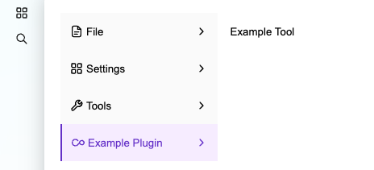

# How to Add a Main Navigation Entry

## Overview
This example demonstrates how to add a new main navigation entry to the Pimcore Studio UI. This can be useful for extending the interface with custom tools or plugins.

## Screenshot

## Details
New entries to the main navigation can be added via the `MainNavRegistry` service from the DI container. The levels of the navigation are automatically created based on the path (e.g., 'Example Plugin/Example Tool'), but it is a good idea to define additional properties such as the icon or an alternative name/label.

## Code Example on GitHub
> [Additional main navigation example on GitHub](https://github.com/pimcore/studio-example-bundle/tree/main/assets/js/src/examples/main-nav-entry).

