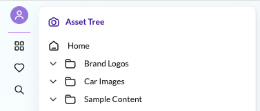

# How to Add an Entry to the Left Sidebar

## Overview
This example demonstrates how to add a heart icon to the left sidebar of the Pimcore Studio UI. 

## Screenshot

## Details
New entries to the left sidebar can be added via the `ComponentRegistry` service from the DI container and the `leftSidebar.slot` [slot](../03_SDK_Overview/05_Component_Registry.md#slots). In this example, a heart icon is added, and clicking on it triggers a modal message.

## Code Example on GitHub
> [Left sidebar icon example on GitHub](https://github.com/pimcore/studio-example-bundle/tree/main/assets/js/src/examples/left-sidebar).
