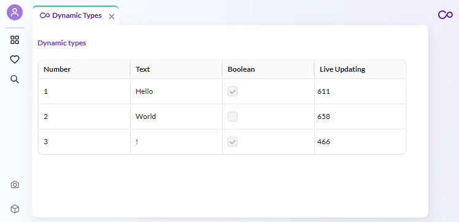

# How to Use Dynamic Types

## Overview

This example shows you how to use dynamic types in Pimcore Studio. This still just a basic example and is using one of the simpler dynamic types.
We will add a new Cell type for the grid. 

## Screenshot

## Code Example on GitHub
> [Dynamic types example on GitHub](https://github.com/pimcore/studio-example-bundle/tree/main/assets/js/src/examples/dynamic-types).
