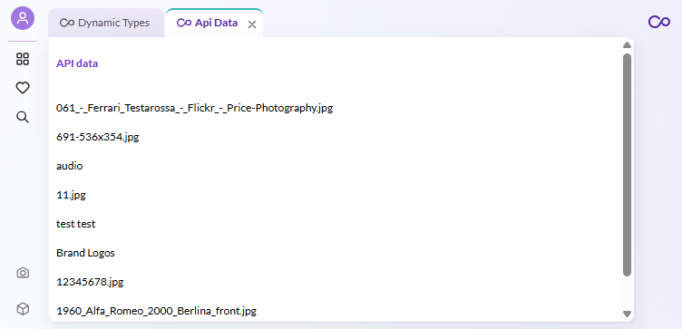

# How to Use Api Data

## Overview

This example shows you how you can use the build in api hook from Pimcore Studio. You will find out how to use the asset tree hook, how to track api errors and how you can show a loading state while the data is still fetching.

## Screenshot

## Code Example on GitHub
> [Api data example on GitHub](https://github.com/pimcore/studio-example-bundle/tree/main/assets/js/src/examples/api-data).
