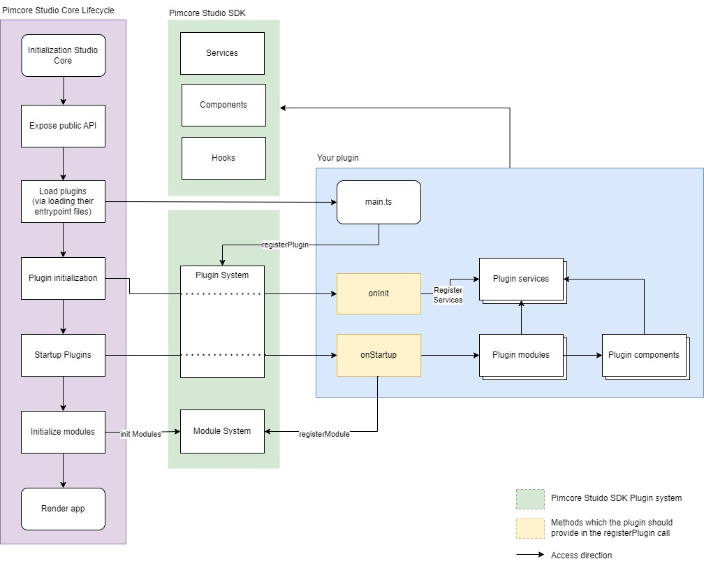

# SDK Overview 

The Pimcore Studio UI includes an SDK that allows you to extend specific features out of the box.
There are some essential parts that we want to explain in more detail.

## Concepts

### Plugin Architecture

Overview how a plugin would be integrated in the Pimcore Studio Core lifecycle:



### Plugins

Plugins empower you to enhance the Pimcore Studio UI by integrating methods directly into its lifecycle. One crucial method is onInit, which enables you to register new services or override existing ones. For instance, you can completely replace the default tab manager for folder assets, thereby customizing the behavior of your registered tabs:

``` typescript
onInit: ({ container }): void => {
    container.rebind(serviceIds['Asset/Editor/FolderTabManager']).to(ExtendedFolderTabManager).inSingletonScope()
},
```

The `onInit`-method is triggered early in the lifecycle. It processes even the modules registered within Pimcore Studio itself through your extended service.

Additionally, there’s the `onStartup`-method, which ensures that all your registered modules execute at the appropriate time.

``` typescript
onStartup: ({ moduleSystem }): void => {
  moduleSystem.registerModule(FolderTabExtension)
}
```

#### Source

- [Plugin system](https://github.com/pimcore/studio-ui-bundle/blob/1.x/assets/js/src/core/app/plugin-system/plugin-system.ts)

### Modules

Modules consist of code snippets executed immediately after initializing all services from the Studio UI Core and Plugins. They run before the initial app render, enabling you to leverage existing services (such as a tab manager) to provide additional configuration for React components during rendering. For instance, you could register a new tab for a folder asset:

``` typescript
export const ImageSliderModule: AbstractModule = {
  onInit: (): void => {
    const tabManager = container.get<FolderTabManager>(serviceIds['Asset/Editor/FolderTabManager'])

    tabManager.register({
      children: <ImageGallery />,
      icon: <Icon name={ 'camera' } />,
      key: 'image-gallery',
      label: 'Image Gallery'
    })
  }
}
```

#### Source

- [Module system](https://github.com/pimcore/studio-ui-bundle/blob/1.x/assets/js/src/core/app/module-system/module-system.ts)

### Services 

Think of services as straightforward objects that assist with specific tasks. For instance, they can help you create a new tab:

``` typescript
const tabManager = container.get<FolderTabManager>(serviceIds['Asset/Editor/FolderTabManager'])

tabManager.register({
  children: <ImageGallery />,
  icon: <Icon name={ 'camera' } />,
  key: 'image-gallery',
  label: 'Image Gallery'
})
```

To maximize the benefits of services, we’ve introduced a service container using [Inversify](https://github.com/inversify/InversifyJS). This container is created early in the application lifecycle, ensuring accessibility throughout the entire app.

#### source

- [Service container](https://github.com/pimcore/studio-ui-bundle/blob/1.x/assets/js/src/core/app/depency-injection/index.ts)
- [Core services](https://github.com/pimcore/studio-ui-bundle/blob/1.x/assets/js/src/core/app/config/services/index.ts)

### Components

Pimcore Studio UI also offers React components to simplify your work. If you’re curious about how they function, explore our Storybook.

#### Source 

- [Component overview](https://github.com/pimcore/studio-ui-bundle/tree/1.x/assets/js/src/core/components)

### Hooks

In this context, hooks refer to [React custom hooks](https://react.dev/learn/reusing-logic-with-custom-hooks). There are numerous hooks available, including one that facilitates interaction with the widget manager:

``` typescript
export const MyFirstTabComponent = (): React.JSX.Element => {
  const widgetManager = useWidgetManager();

  function onClick(): void {
    widgetManager.openBottomWidget({
      name: 'My first widget',
      component: 'my-first-widget',
    });
  }

  return (
    <div>
      <h1>My First Tab</h1>
      <p>This is a simple tab component.</p>
      
      <Button type="primary" onClick={onClick}>Open up my first widget</Button>
    </div>
  );
}
```

#### Source

- [Widget manager hooks](https://github.com/pimcore/studio-ui-bundle/tree/1.x/assets/js/src/core/modules/widget-manager/hooks)

